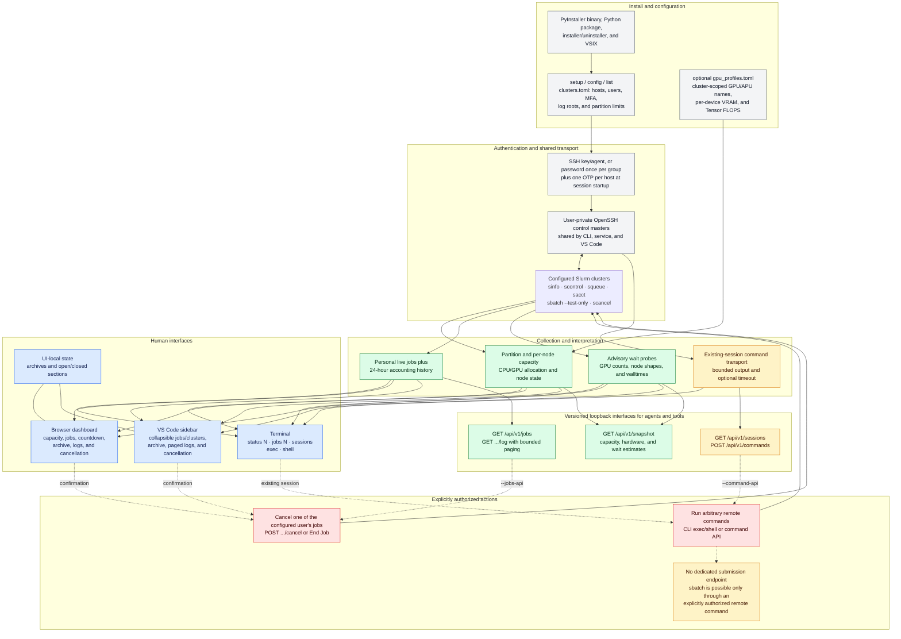

# cluster-watcher

A dependency-free Python command-line prototype for checking several Slurm
clusters through SSH.  It reads a personal `clusters.toml` file, so each
machine can have its own login username.

The code is split by responsibility: `clusterwatcher/config.py` validates
configuration, `models.py` defines shared data, `ssh.py` owns the SSH
transport, `credentials.py` owns ephemeral shared MFA handling, `slurm.py`
queries/parses Slurm, `jobs.py` owns cached personal-job queries and safe log
tails, `commands.py` owns remote-command policy and session inventory,
`snapshot.py` builds the public API contract, `job_scripts.py` locates job
batch scripts, `setup_wizard.py` owns the
interactive `setup` and `config` commands,
`dashboard.py` hosts the webpage and JSON service, and `cli.py` only handles
command-line orchestration. `terminal_jobs.py` owns the terminal job-board
layout and refresh loop. `cluster_watcher.py` remains a minimal executable
entry point. The optional `vscode/` extension is a thin client for the
loopback APIs and contains no SSH or Slurm implementation.

## Capability map



Green boxes are observational data, blue boxes are human-facing views, amber
boxes are security-gated capabilities, and red boxes can change remote state.
The personal jobs and command HTTP interfaces are opt-in and loopback-only.
Archives and disclosure choices belong to the browser or VS Code installation;
they never modify Slurm jobs.

## Install

**Prebuilt executable (recommended).** Linux and macOS need only `bash`,
`curl` (or `wget`), and OpenSSH; no Python. The installer downloads the native
executable for the operating system and CPU from the latest
[GitHub Release](https://github.com/CameronBraunstein/cluster-watcher/releases),
verifies its SHA-256 checksum, and installs `cluster-watcher` in `~/.local/bin`:

```bash
curl -fsSL https://raw.githubusercontent.com/CameronBraunstein/cluster-watcher/master/install.sh | bash -s -- --add-to-path
cluster-watcher setup        # describe your clusters once
cluster-watcher status       # or: cluster-watcher serve --jobs-api
```

Pin a release with `--version v0.1.0`. From a clone, `./install.sh` does the
same, and `./install.sh --from-source` builds the executable locally with
PyInstaller instead (Python 3.11+). Remove it again with `./uninstall.sh`
(also attached to every release).

Windows 10 build 1809 or newer uses the PowerShell installer (Windows ARM64
requires Windows 11):

```powershell
$installer = Join-Path $env:TEMP "cluster-watcher-install.ps1"
Invoke-WebRequest https://raw.githubusercontent.com/CameronBraunstein/cluster-watcher/master/install.ps1 -OutFile $installer
& $installer -AddToPath
cluster-watcher setup
```

Download and run the matching uninstaller when needed:

```powershell
$uninstaller = Join-Path $env:TEMP "cluster-watcher-uninstall.ps1"
Invoke-WebRequest https://raw.githubusercontent.com/CameronBraunstein/cluster-watcher/master/uninstall.ps1 -OutFile $uninstaller
& $uninstaller
```

Native Windows supports clusters authenticated with SSH keys or `ssh-agent`.
Microsoft's native OpenSSH does not implement
the `ControlMaster` connection sharing required to retain password/OTP
sessions, so use Cluster Watcher inside WSL for those clusters. Install and run
the VS Code extension on the WSL side as well. Windows OpenSSH Client must be
installed as an optional Windows feature.

Release binaries cover Linux glibc 2.17+ and macOS 12+ on x86-64 and ARM64,
Windows 10 1809+ on x86-64, and Windows 11+ on ARM64. Alpine/musl Linux is not
currently prebuilt; install from source there. Exact targets and minimums are
published in [`release-platforms.json`](release-platforms.json) and attached to
each release as `PLATFORMS.json`.

**With Python 3.11+.** The package has no dependencies, so it can also be
installed as an ordinary Python application:

```bash
pipx install git+https://github.com/CameronBraunstein/cluster-watcher
```

**VS Code extension.** Install the `.vsix` attached to the release with
**Extensions: Install from VSIX…** (or from the Marketplace once published).
It needs the `cluster-watcher` command from one of the options above; see
[VS Code extension](#vs-code-extension-use-test-and-publish).

## Configure

Run `cluster-watcher setup` (alias `set-up`) for a guided walkthrough: it asks
for each machine's name, host, username, port, optional identity file, whether
it prompts for a password/OTP (and its shared credential group), and log
directories, then validates and writes the `--config` file with mode `0600`.
An existing file is only replaced after confirmation and is kept as
`clusters.toml.bak`.

Run `cluster-watcher config` to open the same file in `$VISUAL`, `$EDITOR`, or
a native fallback (`nano`/`vim`/`vi` on Unix, Notepad or VS Code on Windows).
After the editor exits the file is
validated, and an invalid file can be re-opened immediately. If no file exists
yet, `config` offers to start `setup`. (`--config PATH` still only selects which
file every command uses, so the two can be combined.)

Or copy [`clusters.example.toml`](clusters.example.toml) to `clusters.toml`
and replace the example machines by hand. `clusters.toml` (and its `.bak`) is
git-ignored so personal hosts and usernames are never committed.  Each `[[machine]]`
needs a unique `name`, its SSH `host`, and the `username` to use there.
Optional `port`, `identity_file`, `interactive_auth`, `control_persist`,
`credential_group`, `job_log_roots`, partition runtime limits, and `hidden`
fields are supported. Set `hidden = true` to
keep its configuration while excluding it from every command and service:
Cluster Watcher will not authenticate to it, poll it, list it, or include it in
the dashboard and snapshot API. At least one machine must remain visible.
Remove the field or set it to `false` to enable the machine again.

```toml
[[machine]]
name = "cluster-c"
host = "login.cluster-c.example.org"
username = "alice"
hidden = true
```

Do not put passwords in this file; use SSH keys, an SSH agent, or your normal
`~/.ssh/config` setup.

Wait probes use the smaller of their requested runtime and the configured
partition maximum. Set a default in minutes for the machine, then override
partitions with shorter policies. This example defaults ordinary partitions to
24 hours and caps a `gpudev` development partition at 15 minutes:

```toml
[[machine]]
name = "cluster-b"
host = "login.cluster-b.example.org"
username = "alice"
default_partition_max_time_minutes = 1440

[machine.partition_max_time_minutes]
gpudev = 15
```

`job_log_roots` is an optional list of absolute paths on the remote cluster.
It limits caller-supplied `path` values for the personal log API; paths found
directly through Slurm do not require this option. The service canonicalizes
an explicit path remotely before checking it, so `..` and symlinks cannot
escape an allowed root:

```toml
job_log_roots = ["/home/alice/jobs", "/scratch/alice"]
```

For a host which requires password plus OTP/MFA, enable interactive
authentication on just that machine:

```toml
[[machine]]
name = "cluster-b"
host = "login.cluster-b.example.org"
username = "alice"
interactive_auth = true
control_persist = "8h"
credential_group = "site-b"
```

Machines in the same `credential_group` must use the same `username` and set
`interactive_auth = true`. At `serve` startup, Cluster Watcher asks once for
the group's shared password. It then names each machine and asks for a fresh,
single-use OTP immediately before opening that machine's OpenSSH master
connection. For example, several machines at one site that share a password
but need separate OTPs belong in one group. A machine without `credential_group` preserves the normal OpenSSH
terminal prompts.

The password is held only in process memory while the group starts. Each OTP is
held only while its corresponding machine authenticates and is cleared before
the next OTP is requested. Neither kind of secret is written to configuration,
temporary files, command-line arguments, or environment variables. A small
askpass helper retrieves the appropriate value through a user-private Unix
socket; unrecognized prompts receive no credential. Because host-key
confirmation is intentionally not automated, connect to each host once
manually before using a credential group, or provision its trusted host key
through normal OpenSSH configuration.

If a host rejects authentication—for example because its OTP expired before
OpenSSH completed—Cluster Watcher asks for a fresh OTP for that host and retries
it once. Already established masters remain active. A second rejection is
reported and startup continues by requesting an independent OTP for the next
configured cluster.

OpenSSH keeps each encrypted authenticated connection available for the
configured persistence period, and every dashboard refresh reuses it. Control
sockets are held in a user-private local runtime directory
(`$XDG_RUNTIME_DIR`, or `/tmp` if that is unavailable), rather than your home
directory; this also works on home filesystems that do not support OpenSSH's
atomic socket creation. The in-memory credential broker shuts down and drops
its references to the secrets after startup. For long-lived unattended use,
prefer an institution-approved SSH key or certificate when available.

All configured machines now use OpenSSH multiplexing, including key-based
machines that do not need interactive authentication. Their first ordinary
status query opens a reusable master automatically; password/OTP machines are
still authenticated explicitly before polling starts. `control_persist`
therefore controls the idle lifetime for every machine and accepts standard
OpenSSH values such as `30m`, `8h`, or `1h30m`.

## Use

Python 3.11+ is required (the standard-library TOML parser is used).
Install the project in editable mode once to expose the `cluster-watcher`
command in the active Python environment:

```bash
python3 -m pip install --editable .
cluster-watcher list
cluster-watcher serve
```

If the shell cannot find the command after a user-level install, add the user
Python scripts directory to `PATH`, or activate the virtual environment where
it was installed. `clusters.toml` is resolved from the current working
directory unless `--config` supplies another path.

For development, the original script and module entry points remain available:

```bash
python3 cluster_watcher.py list
python3 -m clusterwatcher list
python3 cluster_watcher.py status
python3 cluster_watcher.py status 15
python3 cluster_watcher.py status research-a --jobs
python3 cluster_watcher.py status --json
python3 cluster_watcher.py status --dry-run
```

Python module identifiers use underscores because hyphens cannot be imported.
All user-facing commands, package names, and standalone artifacts use the
kebab-case `cluster-watcher` convention.

### Terminal jobs board

Print the terminal equivalent of the dashboard's **My jobs** table:

```bash
cluster-watcher jobs
```

The command queries active jobs and the preceding 24 hours of Slurm accounting
history across every configured cluster. Populated groups are separated from
top to bottom by `### RUNNING ###`, `### PENDING ###`, `### COMPLETED ###`,
`### FAILED ###`, and `### CANCELLED ###` rows; empty groups are omitted and
less common states follow under `### OTHER ###`. Each entry includes its job
ID, name, cluster, partition, recorded nodes/GPUs/CPUs, progress, submission
date, launch time, and end time. Launch time is shown for running, completed,
and failed jobs; end time is shown for completed and failed jobs. Other states
display an em dash in those fields. Table columns size themselves to their
content instead of stretching to fill a wide terminal. Running progress bars
are blue and show elapsed versus requested runtime. Pending bars are red and
advance toward Slurm's estimated start time; they explicitly report
dependencies or a missing estimate when no usable start time exists. ANSI
color is omitted when output is redirected or `NO_COLOR` is set, and narrow
terminals automatically use a two-line layout.
Slurm timestamps are collected in UTC and the displayed submission date is
converted to the local timezone of the machine running Cluster Watcher.
Job arrays are requested from Slurm one element per row. A task therefore
appears once using its canonical `ARRAY_JOB_ID_TASK_ID` identifier, and pending
rows retain the requested node, GPU, and CPU counts reported by `squeue` rather
than the still-empty allocated-resource fields from accounting.

Supply a positive interval to keep the board open and refresh it until
`Ctrl-C`:

```bash
cluster-watcher jobs 15
```

This refreshes every 15 seconds. On an interactive terminal, live mode uses a
temporary alternate screen like `top`: each complete board replaces the prior
one, stale boards do not accumulate in normal scrollback, and the original
terminal contents and cursor are restored on `Ctrl-C`, `q`, or an error. The
view is limited to the terminal height so its top rows cannot be pushed away;
use Up/Down, Page Up/Page Down, Home, and End to scroll through longer boards.
Those keys are consumed without being echoed and the scroll position is kept
across data refreshes. This also applies to integrated terminals that report
`TERM=dumb`. When output is redirected to a file or pipe, snapshots remain
sequential and no cursor-control codes are emitted. Before requesting MFA
credentials, the command checks the same user-private OpenSSH control sockets
used by `serve`, `status`, and the session commands. Any active session is
reused without a password or OTP prompt; only an MFA-enabled cluster whose
session is missing or expired is authenticated. The resulting session is
reused on later refreshes. Use `cluster-watcher jobs --help` for the interval
and SSH timeout options.

### Build a standalone executable

PyInstaller can produce a single native executable for machines where Python
is not installed. Python is required only on the build machine. Install the
optional build dependency and run the tracked specification from the repository
root:

```bash
python3 -m pip install --editable '.[standalone]'
python3 -m PyInstaller --noconfirm --clean cluster-watcher.spec
./dist/cluster-watcher-linux-x86_64 --config ./clusters.toml serve --jobs-api
```

The example command above is for 64-bit Intel/AMD Linux. Every distributable is
named `cluster-watcher-<os>-<architecture>` (with `.exe` on Windows). Published
names include `cluster-watcher-linux-x86_64`,
`cluster-watcher-macos-aarch64`, and
`cluster-watcher-windows-x86_64.exe`. Copy the
matching executable and your `clusters.toml` (or run `setup` there) to the
target machine. A bundled application defaults to the native per-user
configuration directory: XDG on Linux,
`~/Library/Application Support/Cluster Watcher` on macOS, and
`%APPDATA%\ClusterWatcher` on Windows. It reads an optional
`gpu_profiles.toml` beside `clusters.toml`. Passwords
and OTPs are never embedded. In a frozen build, the executable securely
re-enters itself as the OpenSSH askpass client, so grouped MFA authentication
does not depend on a separate Python interpreter or `askpass.py` file.

PyInstaller output is specific to the operating system and CPU architecture on
which it is built. Release CI builds each target natively because PyInstaller
is not a cross-compiler. Linux additionally requires at least the glibc version
of the Python it bundles, so Linux release builds use a python-build-standalone interpreter
(installed with `uv`), whose shared `libpython` targets glibc 2.17, and CI
proves each executable starts inside a `manylinux2014` (glibc 2.17) container.
A local `--from-source` build instead inherits your Python's requirements. The target still needs the system `ssh` command and network access to
the configured login hosts—PyInstaller replaces the Python requirement, not
OpenSSH or the remote Slurm installation. Generated `build/` and `dist/`
directories are ignored by Git.

For a complete per-user Linux or macOS installation, use the checked installer
instead of running the PyInstaller steps manually:

```bash
./install.sh --add-to-path                 # download the release executable
./install.sh --from-source --add-to-path   # or build it from this checkout
```

By default the installer downloads `cluster-watcher-<os>-<architecture>` and
`SHA256SUMS` from the GitHub Release (`--version TAG`, default latest) and
refuses to install on a missing entry or checksum mismatch. It also works when
piped into `bash`, since it then needs no checkout. `CLUSTER_WATCHER_REPO`
selects another `owner/repo`, and `CLUSTER_WATCHER_RELEASE_URL` another download
base URL (including `file://` for offline mirrors). With `--from-source` it
checks for Python 3.11+ and the project files and builds in a disposable
virtual environment, so it does not install packages into your normal Python
environment. Either way it checks for OpenSSH and writable, safe destinations,
refuses to run as root, and then atomically installs a platform-qualified
executable plus one stable command shim in `~/.local/bin`, for example:

```text
cluster-watcher-linux-x86_64
cluster-watcher
```

The `cluster-watcher` shim passes the native per-user `clusters.toml`
automatically and selects the correct platform executable, which is why the
stable command works from any directory.
On the first installation, a personal `clusters.toml` beside `install.sh` is
copied there with user-only permissions; without one, the installer asks you to
run `cluster-watcher setup`. Later installer runs preserve that copy so local edits
and usernames are not lost. The installer refuses symbolic-link destinations
and unrelated existing commands. `--force` moves conflicting command files to
a timestamped backup before replacing them; it still never overwrites the
installed configuration. Reinstalling over the earlier underscore-named
prototype migrates its managed files to a recovery backup rather than deleting
them.

`--add-to-path` explicitly authorizes the installer to add `~/.local/bin` to
the appropriate Bash, Zsh, or POSIX shell profile. It verifies the persistent
profile even if the installer process already has that directory in `PATH`,
then backs up an existing profile before appending a marked PATH entry. This
ensures that separately opened terminals also inherit the command. Omit the
option if the profile is already configured or if you prefer to edit your shell
setup yourself. Custom destinations are available through `--bin-dir`,
`--config-dir`, and `--state-dir`; run `./install.sh --help` for details.

`install.ps1` provides the equivalent Windows flow. It verifies the same
`SHA256SUMS`, installs both the architecture-qualified executable and stable
`cluster-watcher.exe` under `%LOCALAPPDATA%\Programs\ClusterWatcher`, preserves
configuration, and changes only the current user's PATH when `-AddToPath` is
specified. `-Version`, `-FromSource`, `-Force`, `-BinDir`, `-ConfigDir`, and
`-StateDir` mirror the Unix installer options. A private sidecar beside the
executable keeps a custom `-ConfigDir` effective when the command is launched
from any working directory.

Some managed systems prohibit direct edits to `.bashrc` or `.zshrc` and source
a user-owned private file instead. When the standard profile actively
references `.bashrc_private`, `.zshrc_private`, or `.profile_private`, the
installer writes to that private file. It uses a recognizable managed block:

```bash
# >>> cluster-watcher initialize >>>
# !! Contents within this block are managed by 'cluster-watcher install.sh' !!
export PATH='/home/example/.local/bin':"$PATH"
# <<< cluster-watcher initialize <<<
```

The uninstaller removes this exact block and remains compatible with the older
two-line `# Added by Cluster Watcher install.sh` format. It will not remove a
similar block whose contents were changed manually.

After opening a new shell, launch from anywhere with:

```bash
cluster-watcher serve --jobs-api
```

If you prefer a literal interactive-shell alias without installing, add this
to the appropriate user-owned shell profile, using absolute paths to this
checkout. On the managed Bash setup described above, that is
`~/.bashrc_private`:

```bash
alias cluster-watcher='/absolute/path/to/cluster-watcher/dist/cluster-watcher-linux-x86_64 --config /absolute/path/to/cluster-watcher/clusters.toml'
```

Reload the profile with `source ~/.bashrc_private` (or the profile appropriate
to your shell). Unlike the installer-created command shim, a shell alias is
generally unavailable to non-interactive scripts.

### Uninstall the standalone application

Run the tracked uninstaller from the repository checkout:

```bash
./uninstall.sh
```

It reads the installer's private manifest and removes only the managed
`cluster-watcher` shim and platform executable. “Remove” is recoverable: files
are moved to a timestamped directory under
`~/.local/state/cluster-watcher/`. The default operation preserves your edited
`~/.config/cluster-watcher/clusters.toml`. To back up and remove that file too,
make the intent explicit:

```bash
./uninstall.sh --purge-config
```

If `install.sh --add-to-path` added a marked PATH block, the uninstaller removes
that exact block and backs up the profile. Pass `--keep-path` to retain it.
When custom installation directories were used, supply the same `--bin-dir`,
`--config-dir`, and `--state-dir` values to `uninstall.sh`. The uninstaller
refuses unknown manifests, symbolic links, root execution, and paths outside
the recorded installation, so it stops instead of guessing what to delete.

On Windows, run `uninstall.ps1`; add `-PurgeConfig` to recoverably remove the
configuration too, or `-KeepPath` to retain the user PATH entry. Like the Unix
uninstaller, it moves managed files to a timestamped state-directory backup.

### Terminal capacity board

`status` prints one table per cluster, separated by headings such as
`## cluster-a ##`. Each partition row shows the strongest single GPU model in that
partition, its per-GPU VRAM and dense FP16/BF16 Tensor throughput in TFLOPS/s,
total CPU threads, current GPU availability, and expected waits for a one-hour
job requesting 1, 2, 4, 8, 16, 32, or 64 GPUs.

```bash
cluster-watcher status
cluster-watcher status 15
cluster-watcher status 15 cluster-a
cluster-watcher status cluster-a
```

The optional first integer enables a live refresh at that interval. Interactive
live mode replaces the stale frame instead of appending output; use the arrow,
Page Up/Page Down, Home, and End keys to scroll, `q` to exit, or `Ctrl-C` to
stop. A non-numeric first argument retains the original machine-selection
behavior, and further names select more clusters. With `--jobs`, each cluster
also gets the legacy `squeue` state summary. `--json` and `--dry-run` remain
one-shot modes and cannot be combined with a refresh interval.

The GPU availability bar renders GPUs that are allocated or currently
unschedulable/reserved in red and schedulable idle GPUs in green. The following
fraction is `schedulable idle / total`; this intentionally does not count an
unallocated GPU on a drained, down, maintained, rebooting, powered-off,
reserved, failed, or unresponsive node as available.

Wait cells are obtained from non-submitting `sbatch --test-only` requests with
a runtime of up to one hour. The actual request is the smaller of one hour and
the partition maximum configured in `clusters.toml`, so development partitions
can be estimated using their permitted 15-minute runtime. `now` means Slurm
predicts immediate placement, and `—` means that partition does not have
enough GPUs for the request. Failed probes use the labels described in
[Why a wait cell has no estimate](#why-a-wait-cell-has-no-estimate) (`DENY`,
`min`, `limit`, `n/a`, `ERR`, `?`). Diagnostics appear beneath the table as
`WAIT DENIED`, `WAIT MIN`, `WAIT LIMIT`, `WAIT N/A`, or `WAIT ERROR` lines with
the affected GPU counts.

Requests larger than one node use a job-wide GPU count and the minimum number
of highest-capacity nodes whose combined inventory can satisfy it; for example,
64 GPUs on eight-GPU nodes is probed as an eight-node job, not as 64 GPUs per
node. The request form (GRES first, job-wide `--gpus=N` when a site asks for
it) is described under [Hypothetical GPU-job wait estimates](#hypothetical-gpu-job-wait-estimates).

To prevent a slow or unsupported `sbatch --test-only` implementation from
blocking the board, partitions are probed concurrently, each in one SSH call.
In live terminal mode each partition has a ten-second budget and each probe a
ten-second limit; shapes the budget did not reach show `?`. Clusters that need
refreshing are also processed concurrently.
Successful estimates are cached for ten minutes in live mode; failures are
retried after 30 seconds. Actual capacity continues to refresh at the interval
requested on the command line. The initial capacity inventories for configured
clusters are collected concurrently as well, so connection latency is not added
serially across clusters.

Minimum-resource policy failures such as `QOSMinGRES` are not propagated to
larger GPU counts, because increasing the request may satisfy that policy.

A failed or unreachable cluster is reported independently, so other configured
clusters still return results.

Use another config location when desired:

```bash
python3 cluster_watcher.py --config /path/to/clusters.toml status
```

## Live dashboard

Launch a local webpage that updates its displayed cluster state every 15
seconds (the server fetches each configured cluster in the background):

```bash
python3 cluster_watcher.py serve
```

It opens `http://127.0.0.1:8080/` automatically and runs until `Ctrl-C`.
The default loopback binding keeps status data local to your machine. To use a
different free port or run on a headless login node:

```bash
python3 cluster_watcher.py serve --port 9000 --no-browser
```

Add `--jobs` to show a job-state summary. The interval can be changed with
`--refresh SECONDS`; avoid lowering it substantially because `sinfo` requests
place load on the Slurm controller.

### How refreshes are kept cheap

Measured on real clusters, every Slurm query takes milliseconds, but each SSH
call costs about one to two seconds, even over the shared control master,
because the cluster starts your login shell and its startup files for every
session. The service therefore:

1. **Uses one SSH call per cluster per refresh.** All of a refresh's commands
   run as one `sh` script (`clusterwatcher/remote_batch.py`); its output is
   split back into per-command stdout, stderr, and exit status with
   random-token marker lines, so one failing command still only affects its
   own part of the status. Clusters are collected in parallel (each still gets
   exactly one call against its own Slurm controller), so a refresh takes as
   long as the slowest cluster. Measured on four clusters, a refresh dropped
   from about 38 s to 2.5-4.3 s. A batch may take up to twice `--timeout` plus
   5 s; a cluster that does not answer in time is reported as "no response
   from the cluster within N s". Wait-time probes are batched the same way,
   one call per partition every ten minutes (see
   [Hypothetical GPU-job wait estimates](#hypothetical-gpu-job-wait-estimates)).
2. **Refreshes capacity every 60 s and your jobs every refresh.** Partition
   and node detail (`sinfo`, `scontrol show node -d`, which is over 1 MB on
   large clusters, and everyone's running-job end times) changes slowly; your
   own `squeue --me` queries run every `--refresh` interval. The snapshot and
   `/api/status` keep the capacity data's own `capacity_updated_at`.
3. **Queries accounting only when your queue changes.** With `--jobs-api`, the
   same SSH call computes a fingerprint on the cluster: a `cksum` of your
   sorted `squeue --me` job IDs and states (never elapsed or remaining time).
   `sacct` runs only when the fingerprint differs from the previous refresh,
   for example when a job starts, changes state, or leaves the queue (when its
   final state must come from accounting), and at least every 5 minutes. The
   personal jobs API serves these records for its default 24-hour window, so
   polling clients cause no `sacct` queries of their own; requests for
   specific `job_id`s or another `since` still query `sacct` directly.
4. **Answers unchanged data with `304 Not Modified`.** `/api/status`,
   `/api/v1/snapshot`, and `/api/v1/jobs` send an `ETag` computed without
   fields that move on every refresh (`generated_at`, `updated_at`, the jobs
   API's default `since`,
   `capacity_updated_at`, elapsed/remaining times, and
   `estimated_wait_seconds`). Clients that send it back in `If-None-Match`
   receive an empty `304` until something real changes. Clients extrapolate
   those moving values from `generated_at`: running jobs' elapsed time and
   wait estimates keep counting on the client's clock, in both the web page
   and the VS Code extension, so times stay current even when nothing new
   has happened.

Enable recent and completed jobs, the personal jobs API, and on-demand log
tails explicitly:

```bash
python3 cluster_watcher.py serve --jobs-api
```

This replaces the active-only data in **My jobs** with collapsible **Running**,
**Pending**, **Completed**, **Failed**, and **Cancelled** groups covering the
last 24 hours; empty groups are omitted. Each job is a collapsed card showing
its name, ID, progress color bar, and current completion/start estimate. Expand
it to see cluster and partition, state, requested resources,
submission/launch/end times, and its controls.
The sort controls above each list order cards by the same fields; locations
sort by cluster and then partition, while resources sort by GPU, CPU, and node
counts. Group and card disclosure state is retained across automatic browser
refreshes while that page remains open.

An expanded card has **Archive**, **Open .err**, and **Open .out** buttons.
The log controls retrieve a bounded 100-line tail only when clicked and show
the remote path and whether the result was truncated. Archived cards move into
the collapsed **Archive** group at the bottom and offer **Restore**. Both lists
are independently sortable. The archive, including a last-seen copy of the job
data, is stored in the browser's local storage for this dashboard origin. It
therefore survives page and browser restarts without writing to
`clusters.toml`; clearing site data or using a different browser/host/port
starts with a separate archive.
Restoring an older saved job also retains its last-seen row locally, so it does
not vanish merely because it has aged out of Slurm's 24-hour query window.

The separately gated SSH session and remote-command services are enabled with
`--command-api`. Both sensitive flags can be enabled together:

```bash
python3 cluster_watcher.py serve --jobs-api --command-api
```

A small analogue countdown clock beside the page title shows the time until
the next status refresh without occupying a full-width progress bar. It resets
only after the new payload arrives, so a slow collection is shown as
`Refreshing…` instead of presenting a misleading countdown.
On startup, the dashboard keeps its loading placeholders visible and retries
once per second until the first background collection completes; it does not
wait for the normal refresh interval before showing the initial cluster data.
Browsers can abandon an in-flight request when a tab reloads, closes, or starts
a replacement refresh. The server treats the resulting broken pipe or reset as
a normal client disconnect and continues serving subsequent requests without
printing a traceback.

The webpage groups nodes beneath their partition names. Each node card displays
its individual GPUs as large cells above its CPUs as smaller cells; red cells
are allocated and green cells are idle. Node state colors and definitions
remain in the glossary. Open/closed partition details are remembered across
automatic data refreshes for as long as the page remains open.

## Reuse authenticated sessions from another terminal

`serve` authenticates the configured interactive machines and creates
user-private OpenSSH control masters. A second terminal on the same local host,
under the same Unix user, can use those masters directly without HTTP and
without entering the password or OTP again:

```bash
# Terminal 1: authenticate and keep the dashboard running.
python3 cluster_watcher.py serve

# Terminal 2: inspect and use those same sessions.
python3 cluster_watcher.py sessions
python3 cluster_watcher.py exec cluster-b -- nvidia-smi -L
python3 cluster_watcher.py shell cluster-b
```

`--command-api` is not required for these CLI commands. They load the same
`clusters.toml` and address the same local control sockets directly. The
terminal must be on the same machine where `serve` was started; an identically
named session on another login node is not transferable. A master may remain
usable after `serve` exits until its configured `control_persist` idle period
expires, but running `serve` is the normal way to keep sessions active.

`sessions` prints each visible machine, whether its master is open, and its
estimated remaining idle lifetime. Use `sessions --json` for the same versioned
document returned by `/api/v1/sessions`. Activity observations are stored in
the private SSH runtime directory so separate Cluster Watcher processes share
the estimate. OpenSSH still does not expose its exact expiry deadline, and
activity from unrelated SSH clients is not observable, so the value can be
`unknown` or approximate.

`exec` treats everything after `--` as a command and argument vector, relays
stdout and stderr, and exits with the remote command's status. By default the
remote command has no execution time limit, so long-running foreground commands
continue until they finish, fail, lose their SSH session, or are interrupted.
Set any positive timeout in seconds before the machine name when a deadline is
desirable:

```bash
python3 cluster_watcher.py exec --timeout 120 cluster-b -- bash -lc \
  'cd /path/to/project && python3 train.py --help'
```

For example, `--timeout 600` permits the remote command to run for ten minutes.

`exec` retains at most 1 MiB from each output stream and returns status 124 when
an explicitly configured timeout expires. Its SSH session health check remains
bounded even when command execution is unlimited. The HTTP command endpoint,
which has a different security profile from the local CLI, continues to default
to a 30-second timeout and requires a value between 1 and 300 seconds. `shell`
inherits the local terminal and opens an interactive
remote shell without an execution timeout.

Neither `exec` nor `shell` initiates authentication or silently reconnects.
Both first verify the named master and disable OpenSSH's direct-connection
fallback. If the machine is unknown, the session has expired, or the connection
drops, the command exits nonzero with a clear diagnostic. Run `login` to
authenticate again after an expired session.

### Log in again after a session closes

A login node can close a shared session (a server restart, a network
interruption, or a session limit), after which every refresh of that machine
fails with an error such as `Permission denied (gssapi-with-mic,password)`.
Re-open it without restarting `serve`:

```bash
cluster-watcher login cluster-b   # one machine and its credential group
cluster-watcher login             # every interactive machine
```

`login` asks only for what is needed:

- Machines whose session is still open are skipped and ask for nothing.
- A named machine brings the other machines of its `credential_group`, so the
  shared password is asked for once for all closed sessions in the group; each
  machine still asks for its own one-time code.
- The running service uses the re-opened session on its next refresh.

When a refresh of an `interactive_auth` machine fails, the service checks
locally (`ssh -O check`) whether its shared session is still open and reports
`login_required: true` in `/api/status` and `/api/v1/snapshot` when it is not;
the web dashboard and the VS Code **Cluster Status** view then offer the login.
Shared sessions also send SSH keepalives every 30 seconds
(`ServerAliveInterval=30`, `ServerAliveCountMax=4`), so a firewall does not
drop an idle session and a broken one is noticed within about two minutes.

## GPU availability web service

While `serve` is running, other programs can read a complete point-in-time
snapshot from this versioned endpoint:

```text
GET http://127.0.0.1:8080/api/v1/snapshot
```

JSON is used because the response contains nested cluster, partition, node,
hardware, and scheduling data while remaining directly usable from most
languages. For example:

```bash
curl --fail --silent http://127.0.0.1:8080/api/v1/snapshot | python3 -m json.tool
```

```python
import json
from urllib.request import urlopen

with urlopen("http://127.0.0.1:8080/api/v1/snapshot") as response:
    snapshot = json.load(response)

for cluster in snapshot["clusters"]:
    for partition in cluster["partitions"]:
        available = partition["gpus"]["schedulable_idle"]
        print(cluster["name"], partition["name"], available)
```

The public contract is separate from the unversioned `/api/status` payload
used internally by the webpage. Incompatible future contracts will receive a
new URL version. A successful request returns HTTP `200` and
`application/json`; before the first background collection completes it
returns HTTP `503` with `Retry-After: 1`. Responses use `Cache-Control:
no-store`, since callers should make routing decisions from current data.

### Snapshot schema

The top-level fields are:

| Field | Meaning |
| --- | --- |
| `schema_version` | Contract version, currently `1.0`. |
| `generated_at` | ISO 8601 time of the underlying status collection. |
| `status_refresh_seconds` | Normal node/partition refresh interval. |
| `wait_probe_refresh_seconds` | Slower `sbatch --test-only` refresh interval. |
| `clusters` | All configured clusters, including unreachable ones. |

Each cluster contains its configured `name` and `host`, `reachable`,
`resource_data_complete`, collection errors, unique cluster-wide resource
totals, the time its wait estimates were last probed, and every known
partition. `error` means the cluster itself could not be queried;
`resource_error` means the basic partition query worked but detailed node/GPU
collection failed. `login_required` is `true` when an `interactive_auth`
cluster failed because its shared SSH session has closed (fix it with
`cluster-watcher login NAME`). Login usernames and personal job details are deliberately
excluded from this public contract.

Each partition contains:

| Field | Meaning |
| --- | --- |
| `name`, `rank`, `available` | Slurm name, compute rank, and whether the partition is administratively up (`null` if Slurm did not report it). |
| `aggregate` | `true` when the partition reuses nodes from specific partitions; do not add its totals to those partitions. |
| `reported_nodes`, `node_states` | Slurm node count and current state distribution. |
| `cpus` | Total, allocated, and idle CPU threads. |
| `gpus` | Total, allocated, idle, schedulable-idle, unavailable-idle, maximum GPUs per node, and model inventory. |
| `wait_estimates` | Hypothetical job-wide GPU and derived node counts, host-memory request, walltime, expected start, computed wait in seconds, any probe error, and its `error_kind` (see [Why a wait cell has no estimate](#why-a-wait-cell-has-no-estimate)). |
| `nodes` | Per-node state, resources, GPU types/specifications, and earliest visible release time. |

`gpus.idle` means physically unallocated. `gpus.schedulable_idle` is the safer
routing signal: it excludes unallocated GPUs on nodes whose Slurm state is
drained, down, failed, maintained, rebooting, powered off, reserved, or not
responding. `gpus.unavailable_idle` is the difference between those values.
GPU model entries include their Slurm type names, catalog status, VRAM, dense
FP16/BF16 Tensor/Matrix throughput, and availability totals. A `null` model
availability means Slurm reported a mixed-type node without enough information
to attribute its current allocations to individual types.

Wait estimates contain `nodes`, `memory_mb`, `walltime_seconds`,
`expected_start_at`, and `estimated_wait_seconds`. They are user/account-specific
scheduler projections, not reservations. Always inspect
`wait_estimates_updated_at`: availability is
refreshed at the normal dashboard interval, while these more expensive probes
are cached for ten minutes. If Slurm cannot evaluate a request, its time fields
are `null` and `error` explains why. Slurm start times without an explicit UTC
offset are interpreted in the web-service host's local timezone when deriving
`estimated_wait_seconds`.

A shortened response looks like this:

```json
{
  "schema_version": "1.0",
  "generated_at": "2026-09-22T10:00:00+00:00",
  "status_refresh_seconds": 15,
  "wait_probe_refresh_seconds": 600,
  "clusters": [
    {
      "name": "cluster-a",
      "host": "slurm-submit.example",
      "reachable": true,
      "resource_data_complete": true,
      "error": null,
      "resource_error": null,
      "wait_estimates_updated_at": "2026-09-22T09:59:00+00:00",
      "resources": {
        "nodes": 8,
        "gpus": {"total": 64, "allocated": 56, "idle": 8, "schedulable_idle": 8, "unavailable_idle": 0}
      },
      "partitions": [
        {
          "name": "gpu-h100",
          "rank": 1,
          "aggregate": false,
          "available": true,
          "gpus": {
            "total": 64,
            "allocated": 56,
            "idle": 8,
            "schedulable_idle": 8,
            "unavailable_idle": 0,
            "max_per_node": 8,
            "models": [{"name": "NVIDIA H100 80 GB", "vram_gb": 80, "fp16_bf16_tensor_tflops": 989.0}]
          },
          "wait_estimates": [
            {"gpus": 1, "memory_mb": 1024, "walltime_seconds": 3600, "expected_start_at": "2026-09-22T10:30:00", "estimated_wait_seconds": 1800, "error": null, "error_kind": null}
          ]
        }
      ]
    }
  ]
}
```

The server binds only to `127.0.0.1` by default. A process on another machine
cannot access it unless you deliberately bind to a reachable interface, for
example `python3 cluster_watcher.py serve --host 0.0.0.0 --no-browser`.
Cluster Watcher does not provide authentication or TLS, so an externally bound
service must be protected with a firewall or an authenticated HTTPS reverse
proxy. The snapshot exposes cluster names, hosts, node names, capacities, and
utilization and should be treated as operational infrastructure data.

## Personal jobs web service

Personal job metadata and logs are deliberately separate from the public
availability snapshot. This API is disabled by default and is enabled with:

```bash
python3 cluster_watcher.py serve --jobs-api
```

`--jobs-api` also enables job collection; `--jobs` is not additionally
required. For safety, Cluster Watcher refuses to start if `--jobs-api` is
combined with a non-loopback `--host`. Accepted values include `127.0.0.1`,
`::1`, and `localhost`. Use an SSH tunnel rather than exposing personal data directly:

```bash
ssh -L 8080:127.0.0.1:8080 user@login-node
```

### Query jobs

```text
GET http://127.0.0.1:8080/api/v1/jobs
```

The response is JSON with `schema_version: "1.0"`, `generated_at`, the applied
`since` and `state` filters, per-cluster reachability/accounting results, and a
flat `jobs` array. By default it returns active jobs plus jobs seen by `sacct`
during the preceding 24 hours.

Optional query parameters are:

| Parameter | Meaning |
| --- | --- |
| `cluster` | Exact configured cluster name; repeat to select multiple clusters. |
| `job_id` | Numeric job ID or `JOB_ARRAY_TASK` ID; repeat to select multiple IDs. A parent array ID also matches its tasks. |
| `state` | `active`, `terminal`, or `both` (default). |
| `since` | ISO 8601 accounting lower bound; defaults to 24 hours ago. A timestamp without an offset is interpreted as UTC. |

For example, the following is one request and therefore one batched `sacct`
query per selected cluster—not one remote request per ID:

```bash
curl --get --fail --silent \
  --data-urlencode 'cluster=cluster-a' \
  --data-urlencode 'job_id=1000101' \
  --data-urlencode 'job_id=1000102_3' \
  --data-urlencode 'state=both' \
  http://127.0.0.1:8080/api/v1/jobs | python3 -m json.tool
```

Every job contains `cluster`, `job_id`, `array_task_id`, `name`, normalized
`state`, `exit_code`, `submit_at`, `start_at`, `end_at`, `elapsed_seconds`,
`partition`, `nodes`, `expected_start_at`, and `reason`. Array tasks remain
separate records and use canonical `ARRAY_JOB_ID_TASK_ID` IDs consistently
across live and accounting data. Slurm annotations such as
`CANCELLED by 12345` are normalized to `CANCELLED`, while `exit_code` is
preserved. Slurm absolute timestamps are collected as UTC and include an
explicit `Z` suffix in the API. The terminal converts them to its local
timezone, while the web dashboard converts them to the browser's local
timezone. This avoids treating a timezone-less UTC accounting timestamp as a
local time.

Results are cached for at least the normal dashboard refresh interval. Active
`squeue` data is merged with `sacct`, providing pending start estimates and
dependency reasons while retaining jobs that have already disappeared from
the queue. If accounting is unavailable, active jobs are still returned,
`accounting_available` is false, and specifically requested unresolved IDs are
returned as `UNKNOWN`. Each cluster has its own `reachable` and `error` fields,
so one failed login does not erase successful results from other clusters.

A shortened response is:

```json
{
  "schema_version": "1.0",
  "generated_at": "2026-09-23T12:00:00+00:00",
  "since": "2026-09-22T12:00:00+00:00",
  "state": "both",
  "clusters": [
    {"name": "cluster-a", "reachable": true, "accounting_available": true, "error": null}
  ],
  "jobs": [
    {
      "cluster": "cluster-a",
      "job_id": "1000101",
      "array_task_id": null,
      "name": "train_model",
      "state": "COMPLETED",
      "exit_code": "0:0",
      "submit_at": "2026-09-22T16:33:15Z",
      "start_at": "2026-09-22T16:33:19Z",
      "end_at": "2026-09-23T16:33:19Z",
      "elapsed_seconds": 86400,
      "partition": "gpu-l40",
      "nodes": ["gpu-node14"],
      "expected_start_at": null,
      "reason": null
    }
  ]
}
```

Active (queued or running) jobs also carry `dependency`: Slurm's raw
dependency expression such as `afterok:1000100(unfulfilled)`, or `null`.

### Cancel a job

```text
POST /api/v1/jobs/{cluster}/{job_id}/cancel
Content-Type: application/json
```

Runs `scancel --user=<configured username> -- <job_id>` on that cluster, so only
the configured account's jobs can be signalled, and clears the jobs cache. The
`application/json` content type is mandatory (any body, e.g. `{}`); browsers
cannot send it cross-origin without a CORS preflight that this server never
approves, so web pages cannot cancel jobs through the loopback service. Success
returns `cluster`, `job_id`, and `cancelled_at`; an invalid ID or cluster
returns `400`, a missing JSON content type `415`, and a remote `scancel` failure
`502`. Like the other personal-job routes it requires `--jobs-api`. The live
queue snapshot catches up on the next status refresh.

### Fetch a job's batch script

```text
GET /api/v1/jobs/{cluster}/{job_id}/script
```

Returns `cluster`, `job_id`, `source`, `path`, `content` (at most 1 MiB), and
`truncated`. Cluster Watcher tries, in order:

1. `scontrol write batch_script` - the exact submitted script, available while
   the job is queued or running (`source: "slurm"`, `path: null`);
2. `sacct --batch-script` - the exact script, only on sites that store it in
   accounting (`AccountingStoreFlags=job_script`; `source: "accounting"`);
3. the file named by the job's recorded `sbatch` command line (`SubmitLine`),
   resolved against its working directory (`source: "file"`). This is the
   file as it is *now*, which may differ from what was submitted.

`clusterwatcher/job_scripts.py` implements the lookup, including parsing the
`sbatch` options that take values. Jobs submitted with `--wrap` or from
standard input, and script files that were deleted, return HTTP `404` with an
explanation.

### Fetch a log tail

```text
GET /api/v1/jobs/{cluster}/{job_id}/log
```

Query parameters are `stream=out|err` (default `err`), `tail=N` (default 100,
hard-capped at 2000), `before=N` (default 0), and optional
`path=/absolute/remote/path`. `before` skips that many lines from the current
end of the file, allowing a client to page backward without transferring the
newer lines again. Cluster Watcher uses `scontrol show job` for a live job and
falls back to `sacct` after it has finished. An explicit ledger path is accepted
only when its remotely
canonicalized value lies under that cluster's configured `job_log_roots`.

```bash
curl --get --fail --silent \
  --data-urlencode 'stream=err' \
  --data-urlencode 'tail=200' \
  --data-urlencode 'path=/home/alice/jobs/project/logs/job.err' \
  http://127.0.0.1:8080/api/v1/jobs/cluster-a/1000101/log \
  | python3 -m json.tool
```

The response contains `cluster`, `job_id`, `stream`, resolved `path`, returned
line count, `before`, `more_before`, the backward-compatible `truncated` alias,
and `content`. Each response transfers at most 2,000 log lines and is fetched
only for an explicit request; backward pages are selected on the remote host
rather than downloading the intervening file. A queued job or a missing file
returns HTTP `404` with a clear JSON `error`; unsafe parameters return HTTP
`400`, and remote query failures return HTTP `502`.

## SSH session and remote-command services

These services permit arbitrary code execution with the configured remote
user's permissions. They are disabled by default and enabled only with:

```bash
python3 cluster_watcher.py serve --command-api
```

As with `--jobs-api`, Cluster Watcher refuses `--command-api` on a non-loopback
`--host`. There is no bearer-token or TLS mode. Use the API from the same
machine or through an SSH tunnel; do not expose it on a shared network.

### Inspect sessions

```text
GET http://127.0.0.1:8080/api/v1/sessions
```

```bash
curl --fail --silent http://127.0.0.1:8080/api/v1/sessions \
  | python3 -m json.tool
```

The versioned JSON response lists every visible configured machine. Each entry
contains `name`, `host`, `username`, `available`, `session_open`, the SSH master
`pid` when available, `control_persist_seconds`, `last_activity_at`,
`estimated_remaining_seconds`, and `error`. `available` means that a live
control master was verified with `ssh -O check` and the command service can use
it now; merely having a machine in `clusters.toml` is not reported as
availability.

OpenSSH does not expose a master's exact idle-expiry deadline. The remaining
time is therefore an estimate based on commands Cluster Watcher processes have
observed. Those observations are shared through the user-private SSH runtime
directory. It is `null` when no observation exists or persistence is unlimited.
Activity from an unrelated SSH client can extend the real lifetime without
updating this estimate. The endpoint checks local control sockets and never
logs in or reopens a connection.

### Execute a command

```text
POST http://127.0.0.1:8080/api/v1/commands
Content-Type: application/json
```

The JSON request has required `machine` and `command` strings plus optional
`timeout_seconds`, which defaults to 30 and must be between 1 and 300. Commands
are non-interactive remote shell text: multiline scripts work, but there is no
TTY, stdin stream, or interactive prompt handling.

```bash
curl --fail-with-body --silent \
  -H 'Content-Type: application/json' \
  --data '{"machine":"cluster-a","command":"hostname; nvidia-smi -L","timeout_seconds":30}' \
  http://127.0.0.1:8080/api/v1/commands \
  | python3 -m json.tool
```

A successful launch returns `machine`, `exit_code`, `stdout`, `stderr`,
`stdout_truncated`, `stderr_truncated`, `timed_out`, `duration_seconds`,
`started_at`, `finished_at`, `connection_dropped`, and the post-command session
state. A nonzero remote exit code is still HTTP `200`; inspect `exit_code`.
Commands are limited to 64 KiB, stdout and stderr are each retained up to 1
MiB, and commands to the same machine are serialized. Excess output is drained
but discarded so it cannot deadlock SSH; the corresponding `*_truncated` flag
is set.

The endpoint first verifies an existing master and does not initiate login or
MFA. Responses distinguish the important failure modes:

| HTTP status | Meaning |
| --- | --- |
| `200` | The command completed; `exit_code` may still be nonzero. |
| `400` | Invalid JSON, command, machine value, timeout, or request field. |
| `404` | The API is disabled, the endpoint is absent, or the machine name is unknown. |
| `409` | The configured machine has no open SSH master. |
| `411` / `413` / `415` | Content length is missing, the request is too large, or it is not JSON. |
| `502` | SSH execution failed or the connection dropped; partial output is returned when available. |
| `504` | The command exceeded its timeout; partial output is returned when available. |

Normal dashboard, wait-probe, job, log, and command operations all share the
same SSH transport and control sockets. The services do not call one another
over HTTP and do not duplicate authentication state.

## Compute ranking

The GPU hardware catalog is personal, optional configuration: a
`gpu_profiles.toml` beside the `clusters.toml` in use (for an installed command,
`~/.config/cluster-watcher/gpu_profiles.toml`). It is git-ignored like
`clusters.toml`; start from [`gpu_profiles.example.toml`](gpu_profiles.example.toml).
`install.sh` adopts a `gpu_profiles.toml` found beside it once, and
`uninstall.sh --purge-config` backs it up and removes it with the configuration.
Without a catalog, Cluster Watcher reports no GPU model, VRAM, or throughput
and ranks partitions by GPU count; a malformed catalog is reported at startup.

Every `[[profile]]` has a required `cluster` field that must exactly equal the
corresponding `[[machine]].name` in `clusters.toml`. This is intentional:
partition and GRES labels are local to a Slurm cluster, so a label such as
`a100` cannot accidentally use another cluster's profile in the combined
dashboard. If a machine is renamed, update its profile entries too. Each
profile stores per-GPU/APU VRAM plus dense peak FP16/BF16 Tensor/Matrix
throughput, without sparsity multipliers. Aliases are matched against GRES
types, partition names, and node names, so a cluster whose GPU partitions are
generic can be identified from node-name prefixes when Slurm does not emit a
GPU type.

AMD MI300A APUs count as GPU scheduling resources: Slurm schedules one APU as
one `gres/gpu`. Some Slurm versions/sites
leave the legacy `Gres`/`GresUsed` fields empty while reporting those resources
in `CfgTRES`/`AllocTRES`. Collection therefore prefers populated GRES data but
falls back to TRES, recognizes both generic and typed `gres/gpu` entries, and
does not double-count an aggregate alongside its model-specific breakdown.
This feeds the dashboard cells, compute ranking, wait probes, and snapshot API,
so `gpus.total`, `allocated`, `idle`, and `schedulable_idle` all include
APUs.

The dashboard passes the source machine name through its status collection and
orders specific partitions by their best single GPU: VRAM first, then Tensor
throughput, then CPU-thread count. It displays that GPU's model and per-GPU
values beside each partition. `*-all` partitions whose nodes are fully covered
by specific partitions are collapsed at the bottom. Every partition has an
expandable arrow for its node-level view. Within an expanded partition, node
cards are ordered by idle GPU count, then idle CPU count. GPU/CPU cells are
drawn idle (green), unavailable (yellow), then allocated (red), and the summary
blocks use the same availability-first ordering.

## Job awareness and wait indicators

The dashboard highlights nodes and resource cells used by your running jobs in
blue. A **My jobs** section at the top combines running and pending work from
all visible clusters. Every row gives the Slurm job name and ID, cluster,
partition, requested node/GPU/CPU counts, state, progress, and submission time.
Running, completed, and failed rows also show their launch time. Completed and
failed rows show their end time. Both columns can be sorted and use the
browser's local timezone.
The same job name—not just its numeric ID—appears in the corresponding
partition heading.
GPU requests are recognized in both Slurm's traditional `gpu:TYPE:COUNT` GRES
form and the `gres/gpu:COUNT` form emitted by some clusters. TRES output that
contains both a generic GPU total and a model-specific breakdown uses the
generic total, avoiding double-counting the same allocation.

Pending jobs have an hourglass and use Slurm's expected start time (when
backfill provides one). They are shown as `< 5 minutes`, `< 30 minutes`, `< 1
hour`, `< 2 hours`, or a nearest-hour estimate thereafter. Internally, the
dashboard runs `squeue --me --start` and reads its `%j` job-name and `%S`
expected-start fields. This is the scheduler's current backfill projection,
not a reservation or guarantee: a priority change, new job, reservation, or a
running job ending early can move it. Clusters without the backfill scheduler
may not provide an expected start time.

The query also reads Slurm's `%V` submission time and `%E` remaining-dependencies
field. When Slurm supplies an expected start, a pending-job progress bar begins
at its submission time and advances toward that estimate. Its label counts down
to the estimated start and also states the job's allotted runtime. If Slurm
cannot estimate a start, the card says so explicitly. A job with an unsatisfied
dependency identifies that dependency and explains that no start estimate is
available until it clears.

Running jobs use Slurm's `%M` elapsed time and `%l` original full time limit to
draw progress from the actual beginning of the allocation—not from when the
dashboard was opened. The label gives elapsed, remaining, and full allotted
runtime. It advances in the browser between status refreshes and re-synchronizes
with Slurm after each refresh. `%L` remains available as a fallback when elapsed
time is absent. Unlimited or unavailable time limits are shown as text instead
of a misleading percentage.

Change the bucket boundaries in your configuration if the defaults do
not suit your workflow. They are positive, strictly increasing minute values;
the final bucket always becomes a nearest-hour estimate:

```toml
[dashboard]
wait_threshold_minutes = [5, 30, 60, 120]
```

Hover a node card to see whether its GPU resources are available now;
otherwise, it shows the earliest visible running-job end time as a
resource-release hint. That hint is not a guaranteed start time because
priority, reservations, and the requested resource shape also affect
scheduling.

## Hypothetical GPU-job wait estimates

The dashboard also shows an **Estimated queue wait** bar chart inside every GPU
partition. It uses `sbatch --test-only`, so no job is submitted
or run. Batch-mode probing is important on sites that limit every `srun`
allocation to short interactive walltimes, even in test-only mode. For each
partition, it derives the available node GPU capacities and probes 1, 2, 4,
and subsequent powers of two. Shapes normally use 1-hour, 12-hour, and 24-hour
walltimes because backfill's expected start depends on the requested duration;
each runtime is capped by that partition's configured maximum, with duplicate
capped durations probed only once. Requests larger than one node (up to 64
GPUs, the tables' last column) are probed only for the shortest walltime, which
is the one the tables show, to keep scheduler queries few. Each probe requests
the fewest nodes that can provide the GPU total, one task per node
(`--ntasks-per-node=1`; with a single task Slurm would silently shrink a
multi-node request to one node), and 1024 MiB of host memory per GPU on each
node. This is sent
as an explicit per-node `--mem` limit because several site submission filters
do not treat `--mem-per-gpu` as satisfying their shared-job memory requirement.
The deliberately small allocation keeps this metric focused on GPU pressure.

The requested GPUs normally use Slurm's `--gres=gpu:N` syntax. If a partition's
submission filter says that this did not request GPUs, the probe is retried
with job-wide `--gpus=N` on the cluster, in the same SSH call. A "More than N
gpus per node" refusal is a per-node policy limit rather than a syntax problem,
so it is not retried. The requested memory is displayed in the dashboard and
returned as `memory_mb` by the API.

All shapes of one partition run in order in a single SSH call (see
[How refreshes are kept cheap](#how-refreshes-are-kept-cheap)); partitions and
clusters are probed concurrently. Each `sbatch --test-only` may take up to 60
seconds, because a busy controller can need tens of seconds to answer, and a
partition starts no further probes after 240 seconds. The first round starts
with the service, and tables show `…` until a cluster's round has finished.

The chart groups bars by requested GPU count and colors them by requested
walltime; its key identifies the 1-hour, 12-hour, and 24-hour series. The
vertical axis is estimated queue wait from zero to 24 hours. A `+` marks waits
beyond the displayed 24-hour range, while a striped marker means the estimate
was unavailable. Hover any bar for its precise current estimate or error.

These probes run in a separate cache no more often than every ten minutes;
they are deliberately independent from the normal dashboard refresh interval.
The result reflects your current account, QOS, fairshare, and queue state, but
is only Slurm's current projection. Cluster Watcher parses successful Slurm
messages from both stdout and stderr. Hover a cell or bar to see Slurm's
recorded message. Subsequent scheduled refreshes try every probe again.

### Why a wait cell has no estimate

Each failed probe carries Slurm's message (`error`) and its classification
(`error_kind` in the API), shown with these labels:

| Label | `error_kind` | Meaning |
|---|---|---|
| `DENY` | `denied` | Your account may not use the partition. |
| `min` | `minimum` | Below the partition's minimum GPU request (`QOSMinGRES`); larger requests may work. |
| `limit` | `limit` | Over a QOS, association, per-node GPU, or time limit for your account. |
| `n/a` | `unavailable` | No node can run it now, for example because all are drained or powered down. |
| `ERR` | `timeout`, `error` | A real failure: Slurm did not answer within 60 seconds, or another error. |
| `?` | `budget` | Not probed: the partition's time budget ran out first. |
| `…` | — | The cluster's first round of probes has not finished yet. |

Only `ERR` is worth investigating; the others describe your account's policy
or the cluster's state.

## VS Code extension: use, test, and publish

The extension source lives entirely in [`vscode/`](vscode/). It contributes a
Cluster Watcher Activity Bar container with two sidebar views:

- **My Jobs** follows the running, pending, completed, failed, and cancelled
  grouping from `cluster-watcher jobs`. State groups and individual job cards
  are collapsible; a collapsed card retains the job name, an ID badge sized to
  the ID (click it to copy the ID), and a progress bar with the elapsed time,
  time limit or start estimate to its right (below it when the sidebar is too
  narrow). State-group and cluster headings use the 11px size of the native
  view headings, and job titles are slightly smaller. Dates use
  `clusterWatcher.dateFormat` (default `DD.MM.YYYY`, tokens `YYYY`, `YY`, `MM`,
  `DD`) followed by 24-hour `HH:mm` local time. Expanded cards show resource requests, submitted/launched/ended
  times, any dependency (each referenced job ID jumps to its card), archive
  controls, stdout/stderr and batch-script actions, and, for running or pending jobs, an
  **End Job** button that confirms before cancelling the job.
- **Cluster Status** follows `cluster-watcher status`: partitions are separated
  by collapsible cluster headings and show the strongest GPU model, per-GPU
  VRAM and Tensor throughput, schedulable GPU availability, one-hour wait
  estimates for 1–64 GPUs, and CPU threads. A wait cell without an estimate is
  labelled as described in
  [Why a wait cell has no estimate](#why-a-wait-cell-has-no-estimate); hover it
  for Slurm's message.

The redundant in-webview **My Jobs** and **Cluster Status** titles are omitted;
the native collapsible VS Code view headings provide those labels. The
**Refresh Sidebar** and **Start Service & SSH Sessions** actions appear once, in
the **My Jobs** view's title bar, rather than once on each view.

The Activity Bar SVG depicts three server boxes with a magnifying glass over
their upper-right corner. It was created specifically for this project and is
released under CC0-1.0. Its SPDX notice and dedicated terms travel with the
asset in [`vscode/media/LICENSE.txt`](vscode/media/LICENSE.txt); it has no
third-party icon-set dependency.

Select **Archive** on an expanded card to move it to the collapsed **Archive**
group at the bottom. **Restore** returns it to the active state group. This
choice is stored in VS Code's extension `globalState`, so it persists across
view reloads and editor restarts. Expanded/collapsed groups and cards also keep
their current state across live data refreshes; the same applies to cluster
sections. **Open .err** and **Open .out** retrieve the newest 2,000 lines
through the loopback jobs API and open them as read-only virtual editor
documents. When older output exists, select the upward-arrow **Load 2,000 Older
Lines** action in that editor's title bar. Every click prepends one bounded
page until the complete file is loaded. The bounded paging API prevents a
single request from reading an arbitrary or unbounded remote file.

The extension first tries `clusterWatcher.backendUrl`, which defaults to
`http://127.0.0.1:8080/`. It therefore attaches automatically when you already
started:

```bash
cluster-watcher serve --jobs-api --no-browser
```

If no service exists, run **Cluster Watcher: Start Service & SSH Sessions**
from the Command Palette or sidebar title. It launches the configured
`clusterWatcher.executable` in an integrated terminal with `serve --jobs-api`,
so password and OTP prompts work like they do in a normal terminal. Set an
absolute executable path and optional `clusterWatcher.configPath` in VS Code
settings when they are not available through the extension host's normal
environment. Automatic startup is deliberately disabled by default so opening
VS Code does not unexpectedly request MFA; opt in with
`clusterWatcher.autoStart`. Before opening the service terminal, the extension
runs the configured executable's `--help` command. A missing, non-executable,
or broken value produces a visible error with an **Open Executable Setting**
button. Set `clusterWatcher.executable` in user or workspace `settings.json`;
`vscode/package.json` declares the setting and should not be edited after the
extension is installed.

The extension does not implement a second SSH client. Its terminal launches
the normal Cluster Watcher executable, which uses the same user-private
OpenSSH `ControlPath` derived from local Unix user, remote user, host, and port.
Consequently, a separately installed executable recognizes masters created by
the extension and the extension-started service recognizes masters created in
another terminal. They must run on the same machine as the same Unix user,
resolve the same endpoint from the same `clusters.toml`, and share the same
runtime environment. The manifest declares this as a workspace extension, so
with VS Code Remote SSH the extension host and executable run on the remote
development host; sessions on your laptop are separate and cannot be reused
across that machine boundary. Never point `backendUrl` at an
untrusted or publicly exposed service: the personal jobs API is intentionally
loopback-only and has no authentication or TLS.

### Test locally

The unit tests require Node.js 20 or newer and do not contact a cluster:

```bash
cd vscode
npm test
```

The integration test downloads a VS Code build into `vscode/.vscode-test/`
(ignored by git), starts it with the extension under development, and checks
that the extension activates, registers every command, and opens both views
with no service running. Headless Linux machines need Xvfb:

```bash
cd vscode
npm install
xvfb-run -a npm run test:integration   # or plain `npm run test:integration` on a desktop
```

For an interactive development run, open the `vscode/` directory as the VS
Code workspace and press `F5`. The included launch configuration opens an
Extension Development Host. In that host:

1. Set `clusterWatcher.executable` or ensure `cluster-watcher` is on `PATH`.
2. Set `clusterWatcher.configPath` if needed.
3. Open the Cluster Watcher Activity Bar view.
4. Run **Cluster Watcher: Start Service & SSH Sessions**, complete any MFA in
   the integrated terminal, and verify both sidebar views refresh.
5. Expand/collapse a state group, job card, and cluster; archive and restore a
   card; open both its `.err` and `.out` virtual documents; and use **Load 2,000
   Older Lines** on a log large enough to paginate.
6. Test attachment by starting `cluster-watcher serve --jobs-api --no-browser`
   separately, reloading the Extension Development Host, and confirming that
   no second service is launched.

Run the Python suite from the repository root as well because the extension
depends on its API contracts:

```bash
python3 -m unittest discover -s tests -v
```

### Package and install a VSIX

Install the publishing tool, run the tests, and build from the extension
directory:

```bash
cd vscode
npm install
npm test
npx vsce package
code --install-extension cluster-watcher-0.1.0.vsix
```

You can also choose **Extensions: Install from VSIX…** in VS Code. Packaging
does not bundle Python or Cluster Watcher; users still install the standalone
executable and point the extension at it.

### Publish to the VS Code Marketplace

The extension is published as `CameronBraunstein.cluster-watcher` (publisher
`CameronBraunstein`). The publisher and the `name` field form the permanent
extension ID; changing either creates a different extension, and local
installs would start with an empty job archive.

1. For each release, bump the version in both `vscode/package.json` and
   `pyproject.toml` and add a dated entry to `vscode/CHANGELOG.md`.
2. Tag the release (`git tag vX.Y.Z && git push origin vX.Y.Z`) so GitHub
   Actions attaches the matching binaries and VSIX. `npm run publish` runs
   `scripts/check-publish.js` first and refuses to publish while placeholder
   metadata remains. The code is licensed GPL-3.0-or-later (`LICENSE`); the
   icons keep their CC0-1.0 dedication.
3. Choose Marketplace authentication following the current
   [official publishing guide](https://code.visualstudio.com/api/working-with-extensions/publishing-extension).
   Interactive `vsce login` currently accepts an Azure DevOps personal access
   token, but global PATs are scheduled for retirement on December 1, 2026;
   prefer Microsoft Entra ID for durable automated publishing.
4. If using the currently supported interactive flow, run `npx vsce login
   <publisher-id>` from `vscode/` and provide the token.
5. Run `npm test`, `npm run test:integration`, `npx vsce package`,
   inspect/install the resulting VSIX, and finally run `npm run publish`
   from `vscode/`.

Marketplace publication is an external release action and is intentionally
not performed by `install.sh` or the repository test suite.

## Tests

Each unit test has a five-second watchdog. A stuck test is interrupted and
reported as an error instead of allowing the suite to run indefinitely.
Run the complete suite from the repository root with:

```bash
python3 -m unittest discover -s tests -v
```

## Continuous integration and releases

[`.github/workflows/ci.yml`](.github/workflows/ci.yml) runs on every push to
`master` and on pull requests: the Python suite on 3.11–3.13 on Linux plus
macOS and native-Windows policy coverage, the extension unit and integration
tests, and six standalone builds covering Linux, macOS, and Windows on x86-64
and ARM64. Linux artifacts are additionally smoke-tested in a glibc 2.17
`manylinux2014` container. The build steps live in the shared
[`build-standalone`](.github/actions/build-standalone/action.yml) action.

[`.github/workflows/release.yml`](.github/workflows/release.yml) publishes a
release when a version tag is pushed:

```bash
# after bumping the version in pyproject.toml and vscode/package.json
git tag v0.1.0
git push origin v0.1.0
```

It first fails unless the tag matches both versions, then builds and smoke-tests
all six native executables, runs the extension tests, packages the
platform-neutral VSIX, attests executable provenance, and creates a GitHub
Release. Alongside the binaries it includes `install.sh`, `uninstall.sh`,
`install.ps1`, `uninstall.ps1`, `clusters.example.toml`, `PLATFORMS.json`, and
the shared `SHA256SUMS`. Marketplace publishing stays a manual step.

Release-environment secrets optionally enable platform trust before checksums
are generated: `MACOS_CERTIFICATE_P12`, `MACOS_CERTIFICATE_PASSWORD`, and
`MACOS_SIGNING_IDENTITY` sign macOS binaries; `APPLE_ID`, `APPLE_TEAM_ID`, and
`APPLE_APP_PASSWORD` additionally notarize them. `WINDOWS_CERTIFICATE_PFX` and
`WINDOWS_CERTIFICATE_PASSWORD` Authenticode-sign and timestamp Windows
executables. Certificate values are base64-encoded PKCS#12/PFX files and must
be protected GitHub secrets. Builds remain checksum-verified but unsigned when
the corresponding signing secret is absent.

## Agent integration

[`AGENT_CAPABILITIES.md`](AGENT_CAPABILITIES.md) is a copy-ready operating
guide for coding or automation agents. It separates observational APIs from
job cancellation and arbitrary remote execution, documents service discovery,
bounded log paging, session reuse, scheduling uncertainty, and the capabilities
Cluster Watcher deliberately does not provide. Its content can be copied into
another project's `AGENTS.md` when that project should use Cluster Watcher as
its cluster-information source.

## License

Cluster Watcher is free software, licensed under the GNU General Public License
version 3 or (at your option) any later version; see [`LICENSE`](LICENSE). The
Activity Bar and Marketplace icons are separately dedicated to the public
domain under CC0-1.0 (`vscode/media/LICENSE.txt`).
